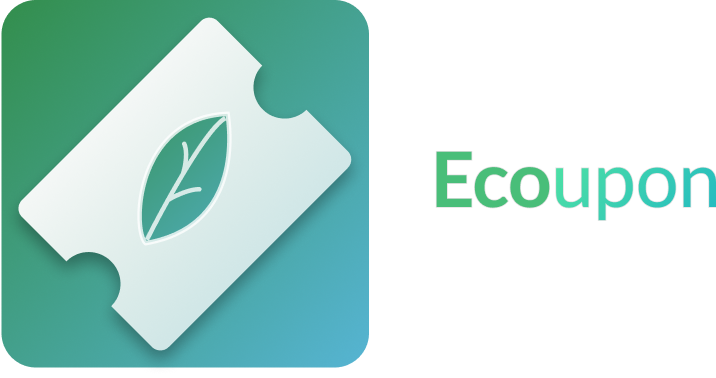
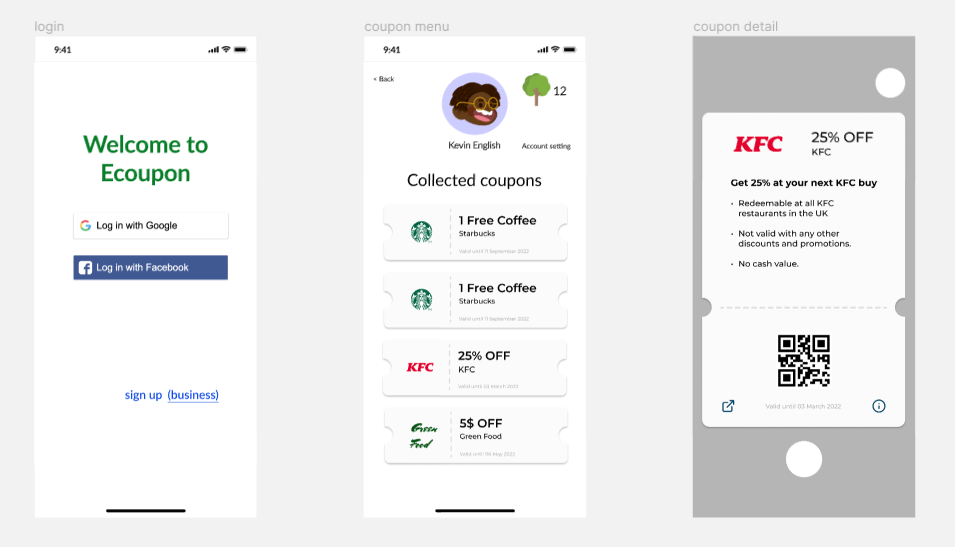
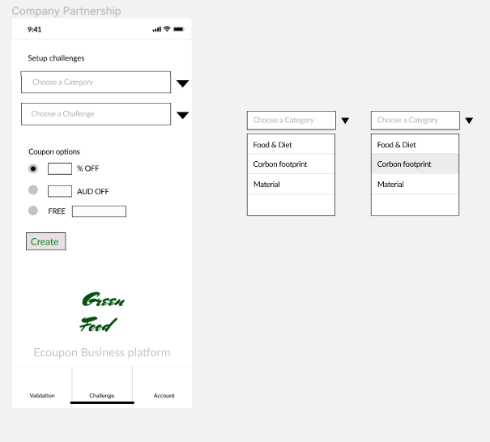

# Ecoupon

A mobile app that provides fun challenges to educate users how to live a healther lifestyle and protect our planet.

**Award**: Most innovative idea of Codebrew 2022

[Devpost](https://devpost.com/software/ecoupon?ref_content=my-projects-tab&ref_feature=my_projects)

## How to install

Run `npm install` in `frontend` folder and `backend` folder

## How to run

Run `expo start` in `frontend` folder

## Design

[Figma link](https://www.figma.com/file/covtt4QlVjNlk8N2g7VgR0/Solarpunk?node-id=0%3A11130)

## Video
[Demo](https://youtu.be/gbwyBAT0yoc)
